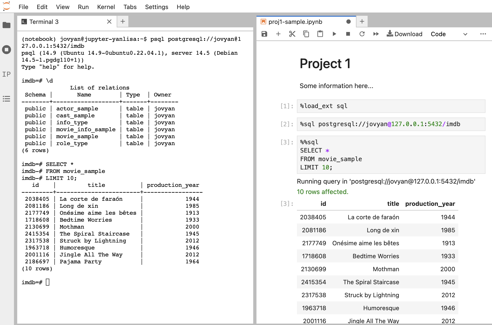

# {{page.title}}
{:.no_toc}
Author: Lisa Yan
Last updated: August 27, 2023 (Fall 2023)

Jump to:
* TOC
{:toc}

<br>

In most of this course, you will use DataHub to work on projects. PostgreSQL has a few quirks with DataHub that will be covered in this document. However, we strongly encourage you to check out the documentation as you work:
* The official [PostgreSQL documentation]({{page.official_docs}}){:target="\_blank"} is great and can even be read cover-to-cover.
* The `jupysql` [documentation]({{page.jupysql_docs}}){:target="\_blank"} is the primary way you will be writing SQL commands for homework submission.

Please see our policies on [collaboration]({{site.base_url}}syllabus/#collaboration-and-integrity) before working with any study groups.

## DataHub

### Working with Jupyter Notebooks

If you are new to using Jupyter Notebooks, please see the first lab assignment of Data 100 ([course website](https://ds100.org/){:target="\_blank"}). Data 101 assignments work very similarly;
there are local and hidden autograder tests, the latter of which are run after you submit your assignment through Gradescope.

**Reminder about adding new cells**:
If you would like to add new cells, always do so **before** the cell in which you end up writing your answer. Failure to do so may break the auto-grader.

## JupyterHub Keyboard Shortcuts
First, to enter shortcut mode/exit editing mode, press `Esc`. This will then enable you to use any of the below keyboard shortcuts.

|Operation|Keys|
|---|---|
|To enter shortcut mode/exit editing mode|`Esc`|
|Enter edit mode | `Enter`|
|Insert cell above|`A`|
|Insert cell below|`B`|
|Delete selected cell|`D` + `D` (Press `D` twice)|
|Undo cell operation|`Z`|
|Copy cell|`C`|
|Paste cell|`V`|
|Paste cell above|`Shift` + `V`|
|Redo|`Ctrl` + `Shift` + `Z`|
|Undo|`Ctrl` + `Z`|

## Jupysql: PostgreSQL via ipython magic

### What is line/cell magic?

Before getting started, read about line magic (``%``) and cell magic (``%%``) [here](https://www.tutorialspoint.com/jupyter/ipython_magic_commands.htm){: target="\_blank"}. These commands will be used extensively in this project and future projects to aid us in running SQL queries.

To call SQL commands, we use the Python package `jupyql`. We strongly recommend you check out the `jupysql` [documentation]({{page.jupysql_docs}}){:target="\_blank"}. It has a lot of hidden gems!

To load jupysql, run:

``%load_ext sql``

You will often seen this written as the following, which lets you reload the extension multiple times if there is an issue.

``%reload_ext sql``

### Making SQL queries in jupysql

Here are the two ways of writing a SQL query and storing the query result into a Python variable `result`:
- Single-line magic: ``result = %sql SELECT * FROM table ...``
- Multi-line cell magic:

``%%sql result <<
SELECT *
FROM table ...``

<!--
For some questions with multi-line cell magic, we will also be saving the literal query string with [query snippets](https://jupysql.ploomber.io/en/latest/api/magic-snippets.html) using `--save`:

``%%sql --save query result << select * FROM table ...``
-->

### Opening a database connection
Before running any SQL queries, you must have a working connection to a database on a postgres server. It usually looks something like this, which connects to the local Postgres server and the database `imdb`.

  ``%sql postgresql://jovyan@127.0.0.1:5432/imdb``

### Closing a database connection

You may sometimes wnat to close the database connection, in case you want to delete your database and start from a new copy. To close the connection, you can either restart your kernel or explicitly run the following in its own cell:

  ``%sql --close postgresql://jovyan@127.0.0.1:5432/imdb``

  If that's not working, see the bottom of this page for how to relaunch your DataHub instance.

## PostgreSQL Client CLI

The `psql` program is the PostgreSQL client CLI, or Command-Line Interface. Knowing `psql` is very useful to understand what your database looks like, execute meta-commands, and explore quick queries.

### Opening a database connection

This connects to the `imdb_lecture` database, if it has been created:
``
psql postgresql://127.0.0.1:5432/imdb_lecture
``

If no database has been created, you can still connect to the server and list databases, etc., as follows:
``
psql postgresql://127.0.0.1:5432
``

### Closing a database connection
`\q`: This exits out of the `psql` program and also closes your current connections.

`\c <databasename>`: This keeps your `psql` client open, closes your current database conection, and opens a connection to `<databasename>`.

### `psql` Meta-commands

Postgres meta-commands doc: [list](https://www.postgresql.org/docs/15/app-psql.html)

|Meta-Command| Description|
|---|---|
| `\l`|  Lists databases |
| `\d` | Lists relations |
| \d tablename			| List schema of the relation `tablename`. |
| \q		| Quit psql |
| \?		| Help | 

**Making queries**: You can write queries in `psql`, too! To write queries that span multiple lines, simply use the newline key (i.e., `<Return>`). However, to execute a query in `psql`, you must use the **semicolon**. This is generally good style, anyway!

**Display screen**: If a query's result will span more than the available display screen, `psql` will launch a different display screen. You can navigate this screen by pressing `<space>` to display more, up/down arrows to scroll up and down, or `q` to quit.

### Terminal commands

Here are some Terminal shortcuts to help you better navigate `psql`:
| Keys | Description |
|---|---|
| <ctrl>-c	| Cancel current operation |
| <ctrl>-a | Jump to beginning of line |
| <ctrl>-e | Jump to end of line |
| <ctrl>-<left> | Jump to previous word |
| <ctrl>-<right> | Jump to next word |
| <space> | If currently exploring a query result, see more of the result. |
| q | If currently exploring a query result, exit from the result. |


## PostgreSQL details

### DataHub's local PostgreSQL Server

Instead of connecting to a remote server, we actually connect to a local server. For example, in Project 1, we connect to:

```
postgresql://jovyan@127.0.0.1:5432/imdb
```

* connect to `localhost` IP (private IP address `127.0.0.1` on port `5432`
* connect using JupyterHub username `joyvan` (why is the default username? see here [Jupyter](https://github.com/jupyter/docker-stacks/issues/358), [JupyterHub](https://github.com/jupyterhub/repo2docker/issues/366))
* connect to the database `imdb` on this server. Note that if the `imdb` database has not yet been created, this connection may fail.

### Catalog, Schema, Relation/Table, etc.

* StackOverflow: [Catalog, Schema, Relation/Table differences](https://stackoverflow.com/questions/7022755/whats-the-difference-between-a-catalog-and-a-schema-in-a-relational-database)

* `pg_toast`: TOAST storage schema [documentation 73.2](https://www.postgresql.org/docs/current/storage-toast.html)
* `pg_catalog`: System catalog schema [documentation 5.9.5](https://www.postgresql.org/docs/current/ddl-schemas.html#DDL-SCHEMAS-CATALOG)

## Debugging on DataHub

**Ruined your database?** 
Just relaunch your DataHub server. You can explicitly stop your entire DataHub server, then relaunch all files: File -> Hub Control Panel -> Stop My Server. Then, refresh the page or navigate back to [https://data101.datahub.berkeley.edu](https://data101.datahub.berkeley.edu/){:target="\_blank"}.

**Want to splitscreen your JupyterHub?** Simply drag a tab over to a different side of your JupyterHub. We recommend splitting your screen with your Jupyter notebook in one window, and a psql terminal in another window, like so (note these are two separate connections to the database!):



## Local Setup
While you are welcome to set up everything locally, when grading we will assume that your submission was developed on DataHub. If you would like to develop locally, please make sure you have the following installed:
* `otter-grader==5.1.3`
* `jupysql==0.10.0`
* `pgspecial=1.13.1`
* `psycopg2==2.9.6`
* `mongodb`
* PostgreSQL server. For Mac, I use [Postgres.app](https://postgresapp.com/){: target=\_blank}.

Either way, we recommend you always work on DataHub, as staff will not be able to debug/support local setup issues in Fall 2023.
